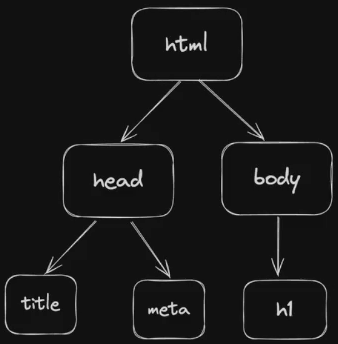
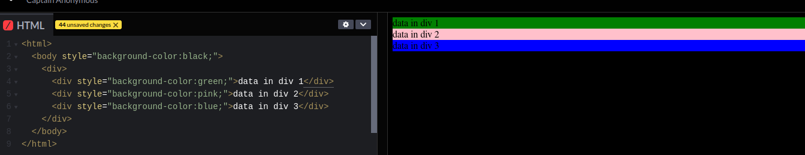
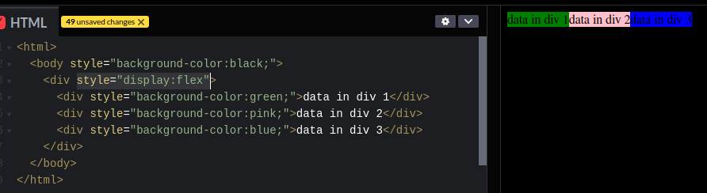
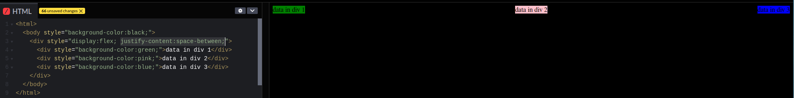
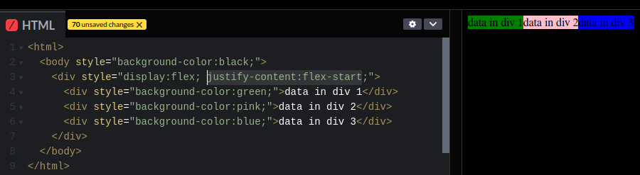
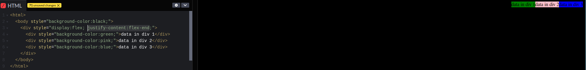
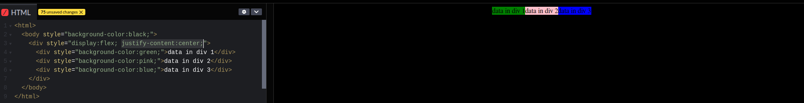
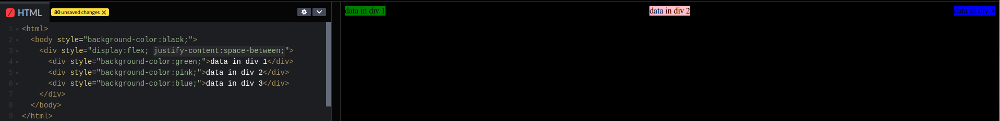
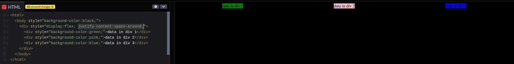

# MY NOTES

## GENERIC

- Taking arguement as env variable in a javascript

```bash
MYNUMBER=100 node index.js
#  Now read the env variable in the script as: console.log(process.env.MYNUMBER)
```

## MISC

- Use <https://httpdump.app/> to create fake endpoints to check your api/ routes.

## Javascript Basics

- Maps:

```javascript
//double each element
const input = [1, 2, 3, 4, 5];

function transform(i) {
  return i * 2;
}

const output = input.map(transform);
console.log(output);
```

- Filters:

```javascript
//filter and display only even values
const input = [1, 2, 3, 4, 5, 6, 7, 8];

function myFilter(i) {
  if (i % 2 == 0) {
    return true;
  } else {
    return false;
  }
}

const output = input.filter(myFilter);
console.log(output);

//alternate way using anonymous function
const output2 = input.filter((n) => {
  if (n % 2 == 0) {
    return true;
  } else {
    return false;
  }
});

console.log(ouptut2);
```

## Async Functions

- Examples - IO Operations(read/ writing to files), timeout/ wait/ timing operations, HTTP Requests
- Architecture for Async Functions
  - Call Stack
    - Data structure to keep track of function calls in the program.
    - It operates in 'Last In First Out' manner. When a function is called, it gets added to call stack and once it completes it is moved out of the stack.
  - Web APIs
    - Provided by Web browser or Node.js runtime.
    - Allows to do activities outside of java-script scope like making network calls, setting timers, or handling DOM events.
  - Callback Queue
    - It is a list of tasks (callbacks) that are waiting to be picked up by Call Stack.
    - These are added by Web APIs
  - Event Loop
    - Constantly checks if Call Stack is empty, if it is, it pushes first call from Callback Queue for execution in Call Stack

## Promises

- Example:
  - Promisified version - setTimeoutPromisified(3000).then(functionToCallback) ;
  - Callback version - setTimeout(fuctionToCallback, 3000);
- A promisified version of an async function does the same thing as the async function itself, it just has better syntax and readability.

```javascript
//Promises

//setTimeout(fuctionToCallback, 3000);

function setTimeoutPromisified(ms) {
  return new Promise((resolve) => setTimeout(resolve, ms));
}

function functionToCallback() {
  console.log("Wait completed");
}

setTimeoutPromisified(3000).then(functionToCallback);

//Following happens on execution
//1. setTimeoutPromisified function is called.
//2. This inturn creates and returns a Promise Object
//3. The Promise object does the following:
//    - It executes the async operation (wating, IO operation , network call etc.) with the provide wait time as arguement.
//    - once the waiting is completed, it calls a 'resolve' object/function. This 'resolve' will actually be the function that is passed in the 'then()'
```

## DOM Manipulation

- DOM = Document Object Model
- Represents the structure of the webpage as a 'tree of objects'
- This was used to create dynamic website before React is included.
- DOM allows manipulation of structure and content of the webpages dynamically.

;

## NODEJS

- It is an open-source JS runtime that allows to execute js code outside of a browser (or in a server).
- Build on Chrome's V8 engine
- Browser engines to run js:
  - chrome - V8
  - firefox - spidermonkey
  - safari - javascriptCore
- BUN
  - Alternate to Node.js (it is also a js runtime.)
  - Completely built from ground up.

### Intializing a project in Node.js

- create project folder
- navigate inside folder
- run - `npm init -y` (you should see some message for package.json)
  - Package.json:
    - name - name of the project
    - version - versioning
      - Format - MAJOR.MINOR.PATCH
        - MAJOR: major version changes or breaking changes from previous version.
        - MINOR: New feature addition or improvements in backward compatible manner.
        - PATCH: Backward compatible bug fixes or improvements.
      - The `^` sign in-front: it means npm will install any version compatible with this version (eg - "^5.3.1" means it can install any version from 5.3.1 to 5.9.9999 but not 6.0.0 because it will be a breaking change)
    - main - which file should be the entry point for the code.
    - scripts - developer specified scripts.
      - Example- Add `"start": "node index.js",` to scripts section. Now you can run `npm run start` in terminal to execute node index.js.
    - keywords - Metadata
    - author - Metadata
    - license - Metadata
    - description - Metadata
    - dependencies - Lists the packages required for the project to run. As the project user installs new packages, it gets added to this section
  - package.json-lock: even though, package.json provides a compatible version to install, sometimes minor version change between 2 developer machines/ local and server may arise due to package updates. This may cause code failures for our project. Hence, lock will automatically, lock to a single version of packages for whoever installs the project locally.
- open the folder in code editor
- create `index.js` in this folder
- Installing external package - `npm install <package name>`
  - This adds a folder `node_modules` in the project folder. node_modules contains the code and dependencies of the package itself.
- Setup project - `npm install`

### Update scripts in `package.json`

- update scripts like below in package.json file

```json
 "scripts": {
    "test": "echo \"Error: no test specified\" && exit 1",
    "start" : "node --env-file .env index.js",
    "dev":"nodemon --env-file .env index.js"
  },
```

- install nodemon - `npm install nodemon`
- run in dev mode (nodemon monitors file changes and automatically restarts server if there are changes) - `npm run dev`
- run in production mode(not using nodemon here) - `npm run start`

### Working with env files

- If node verion is > 20.6, you can use the following instead of installing dotenv module
- Create `.env` file in the project folder.
- Run the file - `node --env-file .env index.js`
- For multiple envs, create separate .env_local or .env_prod and call that file when running the file

```javascript
//.env file contents
API_KEY = "YOUR_API_KEY";
JWT_SECRET = "YOUR JWT SECRET";

//index.js contents to use the data from env file.
const key = process.env.API_KEY;
const secret = process.env.JWT_SECRET;
```

### Some concepts in node.js/ javascript

```javascript
let x = '{"a": "test", "b":"other"}';
typeof x; //string

let y = JSON.parse(x); //convert string to json
typeof y; //object
console.log(y.a); //test
console.log(x.a); //undefined

let z = JSON.stringify(y); //convert json to string
typeof z; //string
console.log(z.b); //undefined
console.log(y.b); //other
```

### Try-Catch block

```javascript
app.post("/signup", async function (req, res) {
  const email = req.body.email;
  const password = req.body.password;
  const username = req.body.username;

  const hashedPassword = await bcrypt.hash(password, 5); //<------- Hashing the password (salt is also generated in it.)

  try {
    const isUserCreated = await UserCollection.create({
      email: email,
      password: hashedPassword,
      username: username,
    });
    console.log(`Is User Created? :[${isUserCreated}]`);

    res.status(200).json({
      message: "Sign up successful",
    });
    console.log(`New user [${username}] registered successfully!`);
  } catch (e) {
    console.log("Error during user registration!");

    res.status(403).json({
      message: "User already exists",
    });
  }
});
```

## HTTP / HTTPS SERVERS

- whenever we use https, port is set to 443 by default
- whenever we use http, port is set to 80 by default
- whenever we use ssh, port is set to 22 by default

### Express

- Js library that lets us create http servers
- Routes: GET, POST, PUT, DELETE etc
- Boilerplate code for express server

```javascript
const express = require("express");
const app = express(); //initialize the app

app.use(express.json()); //allows access to request body

//APPLICATION LOGIC
//some code

//ROUTE HANDLERS
app.get("/", function (req, res){
  console.log("welcome");
  res.status(200).json("{
    "msg": "Welcome to the app!",
  })
});

//Dynamic route parameters in URL
app.get("/add/:a/:b", function(req, res){
  console.log("This is how to read dynamic routes");
  const a = req.params.a;
  const b = req.params.b;

  res.send(200).json("sum": (parseInt(a)+parseInt(b)));
})

app.post("/create-entry", function(req, res){
  console.log("In Post route");
  let data_id = req.query.id; //when url is - https://myapp/create-entry?id=123
  let data_content = req.body; //when body has some data

  res.code(200).send(`Successfully created entry with id: ${id} and data: ${data}`);
});

//LISTEN ON PORT
const PORT = 3000;
app.listen(PORT, () => {
  console.log(`Server started on port: ${PORT}`);
})

```

### Middlewares

- Middlewares are functions that are usually common functions in the server that can handle some common tasks.
- Middlewares need to have next() in their declaration.
- 2 ways to declare:
  - Like a normal function (with additional next() arguement)
  - Like `app.use()`
- Any route below the `app.use()` middleware will use the middleware by default.
- Error middlewares:
  - Special type of middleware.
  - Declared below all the routes.
  - Express will ensure this middleware is run whenever uncaught exception occurs
  - This middleware needs to have an additional arguement `err` in the declaration.

```javascript
const express = require("express");
const app = express();

app.use(express.json());

//APPLICATION LOGIC
let noOfRequests = 0;
let loggedIn = false;

//MIDDLEWARES
function getWelcomeMessage(req, res, next) {
  console.log("Welcome message from the middleware");
  next();
}

function getRequestCount(req, res, next) {
  noOfRequests = noOfRequests + 1;
  next();
}

function isLoggedIn(req, res, next) {
  if (loggedIn) {
    console.log("User is logged in. Continue...");
    next(); //this call is necessary for the control to go to next steps
  } else {
    res
      .status(401)
      .send("User is not logged in or is unauthorized. Terminate code here.");
  }
}

//ROUTES
//METHOD 1 - If middleware function is not passed, it will not be called.
app.get("/", getWelcomeMessage, function (req, res) {
  res.status(200).send("Hello!");
});

//METHOD 2 - All routes below the app.use() call will use the middleware passed here. The Routes do not need to call the middleware anymore
app.use(getRequestCount);

//below route calls getRequestCount automatically. getWelcomeMessage is not called.
app.get("/generic-data", function (req, res) {
  //get the request count after incrementing the counter in getRequestCount() middleware
  console.log(`This is request no: ${noOfRequests} to the server`);
  res.status(200).send("Showing generic content");
});

app.use(isLoggedIn);

//below route calls getRequestCount() and isLoggedIn() automatically.
app.get("/get-my-data", function (req, res) {
  //Below code is run only if both getRequestCount and isLoggedIn() run successfully.
  console.log("Showing only user specific data as the user is logged in");
  res.status(200).json({ msg: "user specific data for logged in user" });
});

//below route triggers error (Make `loggedIn=True`) after running getRequestCount and isLoggedIn()
app.get("/trigger-error", function (req, res) {
  console.log(
    "Triggering error. The error middleware will be called automatically",
  );
  throw new Error();
});

//ERROR MIDDLEWARE
function catchAllUncaughtExceptions(err, req, res, next) {
  console.log("Some uncaught exception occured");
}

//LISTEN TO PORT
const PORT = 3000;
app.listen(PORT, () => {
  console.log(`Server running on port: ${PORT}`);
});
```

### Express Router

- Clean up the index.js file.
- Make the code more modular
- Makes it easy to update the api routes later on. eg - you can have '/api/v1/user' as the top level route in index.js. If you want to change all you have to do is update the index.js file ot '/api/v2/user'.
- If another team is building new APIs for the same product, you can continue to use the old one in production. eg- we can create new top level routes while the existing routes are running in parallel

```text
Folder structure
<project root>
  - routes/
    - users.js
    - courses.js
    - admin.js
- index.js
```

```javascript
//index.js
const express = require("express");

//routers
const { userRouter } = require("./routes/user");
const { courseRouter } = require("./routes/course");
const { adminRouter } = require("./routes/admin");

const app = express();

//Define Routes
app.use("/user", userRouter);
app.use("/course", courseRouter);
app.use("/admin", adminRouter);
```

```javascript
//File = <projectRoot>/routes/users.js

const { Router } = require("express");
const userRouter = Router();

//following route can be accessed using http://localhost:port/user/signup
userRouter.post("/signup", function (req, res) {
  res.status(200).json({
    message: "/user/signup route",
  });
});

//following route can be accessed using http://localhost:port/user/signin
userRouter.post("/signin", function (req, res) {
  res.status(200).json({
    message: "/user/signin route",
  });
});

//following route can be accessed using http://localhost:port/user/purchases
userRouter.get("/purchases", function (req, res) {
  res.status(200).json({
    message: "/user/purchases route",
  });
});
```

### Some API

- Some webpages send background requests after the main call.
- Fetch

```html
<html>
  <head> </head>
  <body>
    <div id="posts"></div>
    <script>
      async function getRecentPost() {
        const response = await fetch(
          "https://jsonplaceholder.typicode.com/posts/1",
        );
        const data = await response.json();
        console.log(data);
        document.getElementById("posts").innerHTML = data.title;
      }
      getRecentPost();
    </script>
  </body>
</html>
```

- Fetch can also be used to make post calls

```javascript
async function sendPostRequest() {
  const response = await fetch("https://jsonplaceholder.typicode.com/posts/1", {
    method: POST,
    headers: {
      "Cookie": "tersitn",
      "content-Type":"application/json"
    }
    ...(more details)
  });
}
```

- AXIOS (external library)

```html
<!doctype html>
<html>
  <head>
    <script src="https://cdnjs.cloudflare.com/ajax/libs/axios/1.7.6/axios.min.js"></script>
  </head>

  <body>
    <div id="posts"></div>
    <script>
      async function fetchPosts() {
        const res = await axios.get(
          "https://jsonplaceholder.typicode.com/posts/1",
        );
        document.getElementById("posts").innerHTML = res.data.title;
      }
      fetchPosts();
    </script>
  </body>
</html>
```

#### ZOD

```javascript
//npm install zod --> to install the lib

const jwt = require("jsonwebtoken");
const JWT_PASSWORD = "123456abcde";
const zod = require("zod");

//create zod schema
const usernameSchema = zod.string().email(); //when username should be valid email
const passwordSchema = zod.string().min(6); //when password should be atleast 6 chars long

function signJwt(username, password) {
  const usernameResponse = usernameSchema.safeParse(username);
  const passwordResponse = passwordSchema.safeParse(password);

  if (!usernameResponse.success || !passwordResponse.success) {
    console.log("Username or password does not match required criteria");
    return null;
  }

  console.log("Generating signature");
  const signature = jwt.sign(
    {
      username,
    },
    JWT_PASSWORD,
  );

  return signature;
}

console.log(signJwt("invalidUsername", "invPa")); //returns null
console.log(signJwt("proper@email.com", "validPass")); // returns signature token
```

```javascript
//install - `npm install zod`

const zod = require("zod"); //<---------import library

app.post("/login", async function (req, res) {
  //<------------Create zod object
  const requriedBody = zod.object({
    email: zod.string().min(3).max(20).email(),
    password: zod.string().min(3).max(10),
  });

  //const parsedData = requiredBody.parse(req.body);
  const safeParsedData = requiredBody.safeParse(req.body);

  //<--------- check if data is in correct format
  if (!safeParsedData.success) {
    console.log(`Data provided is not in expected format`);
    res.status(403).json({
      message: "Invalid data format",
      error: safeParsedData.error,
    });
  }

  //<------ contiue if validation passed
  const email = req.body.email;
  const password = req.body.password;

  //retrive the user based on the email match only(email is also unique but the password entered by user will not match DB password)
  const user = await UserCollection.findOne({
    email: email,
  });
  console.log(`User data found to db : [${user}]`);

  const comparePassword = await bcrypt.compare(password, user.password);
  console.log(`Compare Passwrord Result: [${comparePassword}]`);

  //validate based on comparePassword
  if (comparePassword) {
    const token = jwt.sign(
      {
        id: user._id.toString(),
      },
      JWT_SECRET,
    );

    res.status(200).json({
      token: token,
    });

    console.log(`User with email [${email}] successfully logged in!`);
  } else {
    console.log(`Signin failed for user with email [${email}]!`);
    res.status(403).json({
      message: "Incorrect Credentials",
    });
  }
});
```

### Connecting Front-End and Back-End

#### Different domains for FrontEnd and Backend

```javascript
//FOLDER STRUCTURE
/*
app
  public/
    index.html ----> frontend
  index.js ---> backend
  package.json
  package-lock.json
*/
```

- Serving Backend

  - Navigate to project folder and run --> `node index.js`
  - The server will start running on the port specified in index.js --> `http://localhost:PORT`

- Serving Frontend
  - Navigate to public folder and run --> `npx serve`
  - The front end (index.html) will run localhost at the port specified in the output of the command above.

#### Same domain for Frontend and Backend

```javascript
//FOLDER STRUCTURE
/*
app
  index.html ----> frontend
  index.js ---> backend
  package.json
  package-lock.json
*/


//index.js
const express = require("experess");

const app = express();

app.get("/", function(req, res)=>{
  res.sendFile(process.env.PWD+"/index.html"); //--> Sends the html on the same domain as the backend server
})

app.listen(3000);

//both front end and back end are on http://localhost:3000
```

### CORS

- CORS - Cross Origin Request Sharing
- This is a security feature that controls how resource on one webserver can be requested from another domain.
- Example:
  - User goes to <www.google.com/>
  - The page triggers a `background` request to another domain - <www.api.facebook.com/> ---> should not be allowed by <www.facebook.com>
  - But background request to <www.api.google.com/> should be allowed (as it is from google itself)
- Browser by default inserts `Referrer` into the background request when such background requests are send
- By default such cross origin requests(specially post or put requests) are denied by the called server.
- But most modern sites have different servers for frontend and backend code. In this case, we need to allow background requests between the two.
- If front-end and back-end are in same domain, then CORS issues will not happen(cors middleware is not required). Requests are accepted by default.

```html
<!doctype html>
<html>
  <head>
    <script src="https://cdnjs.cloudflare.com/ajax/libs/axios/1.7.6/axios.min.js"></script>
  </head>

  <body>
    <script>
      async function fetchPosts() {
        const res = await axios.post("https://api.anotherDomain.com/", {
          Authorization: "TestAPIKey",
        });
      }
    </script>
  </body>
</html>
```

```javascript
//index.js (backend code for accepting background reqests from certain domains only)
const express = require("express");
const cors = require("cors"); //---> Import the cors library. Need to do 'npm install cors'

const app = express();

app.use(express.json())
//app.use(cors()) //---> allows background requests from any domains.
app.use(cors({
  domains: ["http://google.com","http://facebook.com"] //---> domains that are allowed to make background request
}));

app.get("/", function(req, res_{
  console.log("Welcome!");
}));

app.listen(3000);
```

### JSONWEBTOKEN(jwt)

```javascript
/* JSON WEB TOKEN - JWT
 * Steps:
 * 1. Install(npm install jsonwebtoken) and import 'jsonwebtoken' library
 * 2. Create a variable to store a random key. `JWT_SECRET` variable
 * 3. Create a jwt token for a user by passing some parameter of the user (username in this case)
 * 4. Use `jwt.verify` to verify the token.
 */
const express = require("express");
const jwt = require("jsonwebtoken"); //STEP 1
const JWT_SECRET = "RandomStringForCreatingJWT1233289"; //STEP 2 (this should be moved to env)
const app = express();

app.use(express.json());

//application logic

let users = [];

//Routes
app.get("/", function (req, res) {
  console.log("Welcome!");

  res.status(200).send("Welcome to my app!");
});

app.post("/signup", function (req, res) {
  const username = req.body.username;
  const password = req.body.password;

  //check if user is already signed to
  if (users.find((user) => user.username === username)) {
    console.log(`Account with username ${username} already exists.`);
    res.status(400).send(`Account with username ${username} already exists.`);
  }

  //create entry into db
  user = {
    username: username,
    password: password,
  };
  users.push(user);
  console.log(`User registered successfully!`);
  res.status(200).send(`User registration successful!`);
});

app.post("/signin", function (req, res) {
  const username = req.body.username;
  const password = req.body.password;

  //Return token if signin successful;
  //TOKEN need not be saved in the db/users[] anymore as the token is `stateless`.
  //The token contains the information required for verification. See app.get("/me")
  if (
    users.find(
      (user) => user.username === username && user.password === password,
    )
  ) {
    console.log("Signin successful");
    res.status(200).json({
      msg: "Signin is successful",
      token: jwt.sign({ username: username }, JWT_SECRET), //STEP 3
    });
  } else {
    console.log(`Signin unsuccessful for user: ${username}`);
    res.status(401).send(`Username or password does not match our records`);
  }
});

app.get("/me", function (req, res) {
  const token = req.headers.authorization; //jwt token will be provided in request
  const decodedInfoFromToken = jwt.verify(token, JWT_SECRET); //STEP 4 (returns {username: username})
  const usernameFromToken = decodedInfoFromToken.username;

  //get the user from db
  const foundUser = users.find((user) => user.username === usernameFromToken);

  if (foundUser) {
    console.log("Displaying user information");
    res.status(200).json({
      username: foundUser.username,
      password: foundUser.password,
    });
  } else {
    console.log(
      `User with username: ${username} not found! This should not have happened with jwt implemented`,
    );

    res.status(500).send("Something went wrong");
  }
});

//LISTEN
const PORT = 3000;
app.listen(PORT, () => {
  console.log(`Server running on port ${PORT}`);
});
```

#### jwt vs cookies

- jwts need to be stored in the browser explicitly. Cookies are stored automatically.
- Cookies are set by the application by using the header `Set-Cookie` and the browser automatically sends the cookie in the `cookie` header in all subsequent requests.
- Cookies only work in webapp/ browser. Wont work in Mobile.

## DATABASE BASICS

### MongoDB Setup

- create account in mongodb site.
- Create an org.
- Select a Project(or create one)
- Click 'Build a Database'
- Select M0 (free).
- Select provider (anyone)
- Select region (anyone, select one that is closer to you)
- Give it a name
- Click 'Create'
- Create credentials for the new DB (choose username/ password)
- Add entries to your IP access List
  - IP Address = 0.0.0.0/0
  - Description = everywhere
- Finish and close
- You should see your database
- Click on connect in the database.
- Select 'Mongodb for VS Code'
  - install extension 'Mongodb for VS code'
  - open command palatte and select mongodb - connect with connection string
  - Copy the connection string from mongodb site, replace with your username and password (created earlier) and paste in VS code.
  - _Keep the Connection string safe(dont upload to github)_
  - Click on Create new playground.

### Basics

- Structure:
  - Select cluster > create DB > create collections(tables) inside this db > each collection can have documents(rows) that contain data.
- Each document(row) contains a unique id called 'object id' provided by Mongodb(unique key for mongodb).
- Advantages of NoSQl:
  - Schema flexibility (very hard to change in SQL DBs)
  - Scalability. NoSQl can scale horizontally. Multiple instances can be setup as required in an easier way than SQL DBs.

### Example project

```javascript
//DB.js FILE
/**
 * STEPS:
 * - import mongoose module
 * - import Schema object from mongoose
 * - MongoDb has its own unique key to identify individual records called ObjectId. we need to import that.
 * - Create schemas for each collections tobe used
 * - Connect the schma and the collection it should belong to.
 * - Export the models so that they can be imported in index.js
 * - Import the models in index.js using `const {UserCollection, TodoCollection} = require("./db");`
 * - In `index.js` file:
 *   - Add connection with mongodb database
 *    - `mongoose.connect("mongodb+srv://<USERNAME>:<PASSWORD>@<CLUSTER_STRING>/<DB NAME>");
 *   - convert the functions interacting with DB into async-await format
 *
 */

const mongoose = require("mongoose");
const Schema = mongoose.Schema;
const ObjectId = Schema.ObjectId;

//create schema for all collections
const UserSchema = new Schema({
  email: { type: String, unique: true }, //email will be unique
  password: String,
  username: String,
});

const TodoSchema = new Schema({
  title: String,
  isCompleted: Boolean,
  userId: ObjectId,
});

//Connect the schema and the collection(table) it should belong to
const UserCollection = mongoose.model("users_table", UserSchema);
const TodoCollection = mongoose.model("todos_table", TodoSchema);

//Export the models so that they can be imported in index.js
module.exports = {
  UserCollection: UserCollection,
  TodoCollection: TodoCollection,
};
```

```javascript
//INDEX.js FILE
const express = require("express");

//SETUP JSONWEBTOKEN INFORMATION
const jwt = require("jsonwebtoken");
const JWT_SECRET = process.env.JWT_KEY;

//IMPORT DATABASE MODELS AND CONNECT TO DB
const { UserCollection, TodoCollection } = require("./db"); //<----------Importing models from db.js file
const mongoose = require("mongoose");
//<----------------------Connecting to database (basic way - dont use)
//mongoose.connect(process.env.MONGO_DB_CONNECTION_STRING);

//<----------------------Connecting to the database - ok ok way
//(async () => {
//  try {
//    await mongoose.connect(process.env.MONGODB_CONNECTION_STRING);
//    console.log(`Successfully connected to DB.`);
//  } catch (err) {
//    console.log(`Error in db connection. Error: [${err.stack}]`);
//  }
//})();

const app = express();
app.use(express.json());

//Middlewares
function auth(req, res, next) {
  const token = req.headers.authorization;
  const decodedData = jwt.verify(token, JWT_SECRET);

  if (decodedData) {
    req.userId = decodedData.id; //add the userid into req object to be used later
    console.log(`user with userid: [${decodedData.id}] is authenticated.`);
    next();
  } else {
    console.log(`User with token: [${token}] is not authenticated`);

    res.status(403).json({
      message: "User is not authenticated.",
    });
  }
}

//ROUTES
app.post("/signup", async function (req, res) {
  const email = req.body.email;
  const password = req.body.password;
  const username = req.body.username;

  //<---------------INSERT 1 DATA INTO DB
  const isUserCreated = await UserCollection.create({
    email: email,
    password: password,
    username: username,
  });

  console.log(`Is User Created? :[${isUserCreated}]`);

  res.status(200).json({
    message: "Sign up successful",
  });

  console.log(`New user [${username}] registered successfully!`);
});

app.post("/login", async function (req, res) {
  const email = req.body.email;
  const password = req.body.password;

  //validate that the email/ password combination is valid
  //<------------- GET 1 ITEM FORM DB
  const user = await UserCollection.findOne({
    email: email,
    password: password,
  });

  console.log(`User data found to db : [${user}]`);

  if (user) {
    const token = jwt.sign(
      {
        id: user._id.toString(), //<---------- this is mongodb unique key for each user
      },
      JWT_SECRET,
    );

    res.status(200).json({
      token: token,
    });

    console.log(`User with email [${email}] successfully logged in!`);
  } else {
    console.log(`Signin failed for user with email [${email}]!`);
    res.status(403).json({
      message: "Incorrect Credentials",
    });
  }
});

app.post("/todo", auth, async function (req, res) {
  const title = req.body.title;
  const isCompleted = req.body.isCompleted;

  //add new todo item for user in DB
  //<------------------ adding new entry to database.
  const isTodoAdded = await TodoCollection.create({
    title: title,
    isCompleted: isCompleted,
    userId: req.userId, //read data from udpated request
  });

  console.log(`Todo item added: [${isTodoAdded}]`);

  res.status(200).json({
    message: "Todo item added!",
  });
});

app.get("/todos", auth, async function (req, res) {
  //get all the todos for the specified user from todos collection
  //<------------------- Get all data for particular user
  const allTodos = await TodoCollection.find({
    userId: req.userId,
  });

  console.log(`All Todos are displayed: [${allTodos}]`);

  res.status(200).json({
    allTodos: allTodos,
  });
});

//<---------------------------Connecting to database - better way (ensures app starts listening only when db is connected)
//Do mandatory steps that should complete before starting the app here
async function main() {
  //CONNECT TO DATABASE
  await mongoose.connect(process.env.MONGODB_CONNECTION_STRING);
  console.log(`Successfully connected to DB.`);

  //LISTEN
  app.listen(process.env.PORT, () => {
    console.log(`Server started on port: [${PORT}]`);
  });
}

main();
```

## PASSWORD ENCRYPTION

### Hashing

- Storing user passwords in database as plaintext is NOT a good practice.
- Hashing can be used.
  u- Hashing is a 1-way algorithm that converts a String into another random string.
- eg - Ram -> lksdjfi938027
- It is deterministic, i.e, everytime hashing is applied to 'Ram' it will lead to 'lksdjfi938027'
- Process:
  - User signsup with password 'Ram'.
  - Backend applied hashing and converts Ram into a hash 'asdf1234'
  - This hashed password is stored in DB.
  - Next time user logs in with password 'Ram', the backend again applies hashing algorithm and converts it to 'asdf1234' and compares with DB, thereby authenticating the user successfully.
- But Hashing has a problem.
  - if 2 users have same password, their hashed password will also be same.
  - So if 1 users password is desiphered(eg- by social engineering the user), all the users who have the same password are also at risk
  - To avoid this, 'Salting' is used.

#### Salting

- Process:
  - User signs up with password 'Ram'.
  - Backend adds a random string at the end of password 'poiu12' and make it 'Rampoiu12'.
  - This new string is then hashed to generate 'asdf1234' as hashed password.
  - DB now stores both the hashed password 'asdf1234' and salting string 'poiu12' for the user.
  - Next time user logs in with password 'Ram', backend retrieves both the hashed password and the salting string.
  - Backed appends the salting string to the password and applies the hashing algorithm, then compares the output to what is retrieved from DB.
- This way even though 2 users may have the same password, their hash saved in the DB will be different.
- This approach also helps guard against rainbow tables (Pre-created table that contains a list of common passwords and their hashed counterpart. When DB gets leaked, hackers can just compare the hashes and derive the actual password used)

```javascript
//NOTES:
//* 'bcrypt' is an npm module that provides hashing with salting inbuilt
//* install - `npm install bcrypt`
//* bcrypt.hash(password, 5) takes user provided password and a number to generate hashed pass and slat. The number represents the number of times the hash should be applied. The higher the number the longer it takes to generate the hashed password.
//* The generated hash contains both the salt and the hashed password.
//* eg - output will be of format like $2b$05$sdlkfeowijw98792ldfkgldfklrildklkdligrjdligjdrlij
//  - $02b represents the algorithm used
//  - $05 represents the number used in the hash() function
//  - $xxxxx contains both the salt and the actual hashed password (first 16 or some digits are salt string and the rest are hashed password)
//bcrypt.compare() automatically retrieves the algorithm, number and salt values form the db string and applies hash() on the provided password again for comparision

//PASSWORD ENCRYPTION
const bcrypt = require("bcrypt"); //<---------Import the module

//ROUTES
app.post("/signup", async function (req, res) {
  const email = req.body.email;
  const password = req.body.password;
  const username = req.body.username;

  const hashedPassword = await bcrypt.hash(password, 5); //<------- Hashing the password (salt is also generated in it.)

  const isUserCreated = await UserCollection.create({
    email: email,
    password: hashedPassword, //<------ hashedpassword contains both the password and the salt string
    username: username,
  });

  console.log(`Is User Created? :[${isUserCreated}]`);

  res.status(200).json({
    message: "Sign up successful",
  });

  console.log(`New user [${username}] registered successfully!`);
});

app.post("/login", async function (req, res) {
  const email = req.body.email;
  const password = req.body.password;

  //retrive the user based on the email match only(email is also unique but the password entered by user will not match DB password)
  const user = await UserCollection.findOne({
    email: email,
  });
  console.log(`User data found to db : [${user}]`);

  const comparePassword = await bcrypt.compare(password, user.password); //<---auto compares the user entered password and hashed DB password
  console.log(`Compare Passwrord Result: [${comparePassword}]`);

  //validate based on comparePassword
  //<---- respond based on compared password
  if (comparePassword) {
    const token = jwt.sign(
      {
        id: user._id.toString(),
      },
      JWT_SECRET,
    );

    res.status(200).json({
      token: token,
    });

    console.log(`User with email [${email}] successfully logged in!`);
  } else {
    console.log(`Signin failed for user with email [${email}]!`);
    res.status(403).json({
      message: "Incorrect Credentials",
    });
  }
});
```

## REACT

- Introduced by facebook when they became too big for managing frontend
- React is an easier way to write normal HTML/CSS/JS. It is a new syntax that gets converted to HTML/ CSS and JS under the hood.
- React code -> `npm run build` -> converts the code to HTML/CSS/JS that gets deployed into the server

```html
<html>
  <script>
    function onButtonPress() {
      const currVal = document.getElementById("button1").innerHTML;
      const countVal = currVal.split(" ")[1];
      const newCountVal = parseInt(countVal) + 1;

      document.getElementById("button 1").innerHTML = "Counter " + newCountVal;
    }
  </script>

  <body>
    <button onclick="onButtonPress()" id="button1">Counter 0</button>
  </body>
</html>
```

- 3 parts - state, component, re-rendering
- State:
  - object that represents the current state of the app.
  - represents the dynamic things in the app (value of the counter above)
- Component:
  - re-usable, dynamic snippet that changes given the state
  - determines how a dom element should look like given the state
- Re-render
  - A state change triggers a re-render.
  - A re-render represents the dom change when dom is being manipulated.
- Basically in a react app:
  - Create components
  - Create state variables
  - Associate state to the components
  - React will take care of updating(re-rendering) the UI/dom when state changes

```html
<!-- same example as above but including the react logic. we are writing ourlogic as well as react logic together-->
<!doctype html>
<html>
  <body>
    <div id="buttonparent"></div>

    <script>
      let state = {
        count: 0,
      };

      function onButtonPress() {
        state.count++;
        buttonComponentReRender();
      }

      function buttonComponentReRender() {
        document.getElementById("buttonparent").innerHTML = ""; //remove current elements
        const component = buttonComponent(state.count); //select the component to rerender
        document.getElementById("buttonparent").appendChild(component); //render the button on the UI
      }

      function buttonComponent(count) {
        const button = document.createElement("button"); //create button element
        button.innerHTML = `Counter: ${count}`;
        button.setAttribute("onclick", "onButtonPress()"); //add attributes to it
      }

      buttonComponentReRender(); //call it once so that it renders the button first time the page loads
    </script>
  </body>
</html>
```

- jsx is a javascript XML. it is a syntax extension to javascript. Can be used to write HTML like code directly in javascript.

```jsx
<!-- same example in react -->
<!-- FILE NAME - App.jsx -->
import {useState} from 'react';

export default App(){
  const [count, setCount] = useState(0); //initialize state variable 'count' with val=0. 'setCount' is the function to update count
  //'count' should be updated using 'setState' function only otherwise, react will not trigger re-render.

  function onButtonPress(){
    setState(count+1);
  }

  //notice the syntax changes below. It is not html, it is xml
  return(
  <div>
      <button id="btn" onClick={onButtonPress}>Counter {count}</button>
  </div>
  )
}
```

```jsx
<!-- same example. This time in react -->
<!-- FILE NAME - App.jsx-->
import React from 'react'

function App(){
  const [count, setCount ] = React.useState(0); //initializing state. 'state' is the variable(value set to 0 here), 'setState' is the function to control it

  //Note - it is 'Button' and not 'button'
  return (
    <div>
      <Button count={count} setCount={setCount}></Button>
    </div>
  )
}

//
function Button(props){
  function onButtonPress(){
    props.setCount(props.count + 1); //state management logic goes here.
  }

  return <button onClick={onButtonPress}>Counter {props.count}</button>
}

export default App

```

- Some terms to read about - diffing, VDOM, Bulk updates, Reconcilliation, context api, prop drilling

### Creating REACT app locally

- Using Vite(most popular)
  - navigate to folder 1 level above the project folder
  - run `npm create vite@latest`
  - follow the prompts and create project
    - enter project name
    - package name can be same
    - framework - react
    - language - javascript
  - `cd <projectName>`
  - `npm install`
  - `npm run dev`
  - app will start locally and will provide url to access.
  - Killing running app:
    - `ctrl+c` if you have access to terminal where the process is running
    - if you do not have access to the terminal where the app was started:
      - `px -ax | grep vite`
      - `kill -9 <pid>` get the pid from above command

### Control flow in React App

- Folder structure

```Text
- ProjectRoot
  - public/
  - src/
    - index.css
    - App.css
    - main.jsx
    - App.jsx
  - index.js
  - eslint.config.js
  - package.json
  - package-lock.json
  - vite.config.js
  - Readme.md
```

- Start in `index.html`. it provides the basic structure to the webapp. The script being called in `script` is /src/main.jsx
- main.jsx -> This file points to the html tag that will be controlled by React in App. (document.getElementById("root"))
- App.jsx -> All the code to be handled by React goes here. Most of the code goes here.
- There can be multiple html tags that are controlled by React in the main.jsx. You need to have the tags present in index.html, have entry in the main.jsx and have currosponding jsx file imported.

### Children prop

- Can be used to create a template for the HTML elements
- What ever is within the tag will automatically become the child(see 2nd 'Child' element in example below)
- It is like a wrapper component
- Can use multiple elements of the same component for having different children

```jsx
export default function App() {
  return (
    <>
      <div className="item9">
        <h2>Children prop</h2>
        <Child
          children={<div>I am also a child and will be displayed</div>}
        ></Child>
        <Child>
          <div style={{ color: "red" }}>
            <div>Post your thoughts</div>
            <input type="text" />
          </div>
        </Child>
      </div>
    </>
  );
}

function Child({ children }) {
  return (
    <>
      <div
        style={{
          background: "lightblue",
          borderRadius: 10,
          color: "balck",
          padding: 10,
          margin: 10,
        }}
      >
        {children}
      </div>
    </>
  );
}
```

### Adding keys to lists

- when using dynamically generated lists, provide keys or react will show warning message
- React uses keys to optimize the re-rendering.

```jsx
function MyTodos() {
  let mytodos = [
    {
      title: "gym",
      done: false,
      id: 1,
    },
    {
      id: 2,
      title: "eat",
      done: true,
    },
  ];
  const [todos, setTodos] = setState(mytodos);

  const showall = todos.map(todo => <div key={todo.id}>{todo.title} -- {todo.done}<div>);

  return (
  <div>{showAll}</div>
  )

}
```

### Inline styling

- Some syntax differences between normal HTML styling and react styling
- double `{{}}` are required in react

```jsx
<Child>
  <div style={{ color: "red" }}>
    <div>Post your thoughts</div>
  </div>
</Child>

const componentStyle = {colour: "blue"}
<MyComponent>
  <div style={componentStyle}>
    My colour is blue
  </div>
</MyComponent>

function MyComponent(){
    return (
      <div style={componentStyle}>
        Test
      </div>
      </div style={{color:"black"}}>
        double brackets again
      </div>
    )
}

```

### Error Boundary

- Without this, if there is an error in 1 component, the entire page does not display/ app crashes.
- Error boundary allows the error to stay in the component and other components display normally.
- But the error boundary has to be implemented in old way in React using `class based Components`.
- Most companies have the following code as black box and just use it till error boundary is introduced in new React way `function based Components`

```jsx
export default function App(){
  return (<>
    <ErrorBoundary>
      <Card1 />
    </ErrorBoundary>
    <Card 2/>
  </>)
}

function Card1(){

  //throw new Error("Error while rendering");

  return (
  <div style={{background: "blue", borderRadius: 20, padding: 20, margin: 20}}>
    data in card 1
  </div>
  );
}

function Card2(){
  return (
    <div style={{background: "blue", borderRadius: 20, padding: 20, margin: 20}}>
      data in card 1
    </div>
  );
}

class ErrorBoundary extends React.Component {
  constructor(porps){
    super(props);
    this.state = {hasError: false}
  }

  static getDerivedStateFromError(error){
    return {hasError : true}
  }

  componentDidCatch(error, info){
    console.error("Error caught: ",error, info);
  }

  render(){
    if(this.state.hasError){
      return (
        <div style={{background: "blue", borderRadius: 20, padding: 20, margin: 20}}>
          Some error occured
        </div>)
    }
    return this.props.children;
  }
}
```

### Fragments in react

- helps to avoid unnecessary element tags
- if you want your component to be right below the root element return with <></>

```jsx

function MyComponent(){
  return (
    <div>
      <div>Element 1</div>
      <div>Element 2</div>
    </div>
  )
}

gives final html-->
<html>
  <body>
    <div id="root">
      <div>
        <div>Element 1</div>
        <div>Element 2</div>
      </div>
    </div>
  </body>
</html>

but using fragment
function MyComponent(){
  return (
    <>
      <div>Element 1</div>
      <div>Element 2</div>
    </>
  )
}

gives final html-->
<html>
  <body>
    <div id="root">
      <div>Element 1</div>
      <div>Element 2</div>
    </div>
  </body>
</html>

```

### React Lifecycle events

#### Mounting

- The following code will not run properly in the long run. The app tries to run a timer that increases the count every second. The reason the app does not run properly in the long run is the following:

  - The counter function called everytime the setCount function is called. This means setInterval is re-called every time the state changes(setCount is called). Each setInterval then tries to update the state every second causing a recursive loop.

- The solution to this problem is to utilize lifecycle events of React.
- Mounting happens when Counter function is called for the first time.
- Mounting is done using `useEffect()` hook
- useEffect is used to avoid `side effects`. side effects are operations that interact with the outside world and have effects other than rendering(eg: starting a clock, fetching data from API)

```jsx
import { useState } from "react";

export default function App() {
  function Counter() {
    const [count, setCount] = useState(0);

    setInterval(function () {
      setCount(count + 1);
    }, 1000);

    return (
      <>
        <div>
          <h1>{count}</h1>
        </div>
      </>
    );
  }

  return (
    <>
      <div>My App</div>
      <Counter></Counter>
    </>
  );
}
```

- Code using `useEffect()` hook

```jsx
import { useState, useEffect } from "react";

export default function App() {
  function Counter() {
    console.log("this function run on every re-render");

    const [count, setCount] = useState(0);

    //useEffect takes 2 args, a function and dependencies
    useEffect(function () {
      const clock = setInterval(function () {
        setCount((count) => count + 1);
        //below line will not work without passing dependency
        //setCount(count+1);
      }, 1000);
      console.log("This hood runs only once. On mounting/ first render");

      return function () {
        console.log("This returns only when un-mounting");
        clearInterval(clock); //builtin function to stop running setInterval
      };
    }, []);

    return (
      <>
        <div>
          <h1>{count}</h1>
        </div>
      </>
    );
  }

  return (
    <>
      <div>My App</div>
      <Counter></Counter>
    </>
  );
}
```

- Dependency Array:
  - it tells useEffect when to run.
  - if empty, useEffect runs only once.
  - on providing a state variable, useEffect will run whenever the state variable changes
  - the return statement inside useEffect is used to clean up the code. It will run when react knows the useEffect needs to be cleared/ when the component effected by useEffect is no longer needed to be rendered.

```jsx
import { useState, useEffect } from "react";

export default function App() {
  const [count, setCount] = useState(0);
  const [count2, setCount2] = useState(100);

  function increaseCount1() {
    setCount((c) => c + 1);
  }

  function decreaseCount2() {
    setCount2((c) => c - 1);
  }

  return (
    <>
      <h1>My Sample React App</h1>
      <Counter count={count} count2={count2}></Counter>
      <button onClick={increaseCount1}>Increase Count 1</button>
      <button onClick={decreaseCount2}>Decrease Count 2</button>
    </>
  );
}

function Counter(props) {
  useEffect(function () {
    console.log("runs when mounting");

    return function () {
      console.log("runs when unmounting");
    };
  }, []);

  useEffect(
    function () {
      console.log("when mounting - count");

      return function () {
        console.log("when unmounting - count");
      };
    },
    [props.count],
  );

  useEffect(
    function () {
      console.log("when mounting - count2");

      return function () {
        console.log("when unmounting - count2");
      };
    },
    [props.count2],
  );

  return (
    <>
      <div>Counter 1: {props.count}</div>
      <div>Counter 2: {props.count2}</div>
    </>
  );
}
```

- The above code will give following output:

  - when app is initialized

    ```text
    runs when mounting
    when mounting - count
    when mounting - count2
    ```

  - when 'increase count 1' button is clicked

    ```text
    when unmounting - count
    when mounting - count
    //here clean up will run first and then the next round.
    //the clean up will be called everytime the button is press and useEffect is called.
    ```

  - when 'decrease count 2' button is clicked

  ```text
  when unmounting - count2
  when mounting - count2
  ```

#### Re-rendering

- normal behaviour.
- Counter function will keep rerendering if setCount is called.

##### Conditional re-rendering

- re-render based on a condition

```jsx
import { useState, useEffect } from "react";

export default function App() {
  const [isVisible, setIsVisible] = useState(true);

  useEffect(function () {
    setInterval(function () {
      setIsVisible((c) => !c);
    }, 5000);
  }, []);

  function Counter() {
    const [count, setCount] = useState(0);

    useEffect(function () {
      const clock = setInterval(function () {
        setCount((count) => count + 1);
      }, 1000);

      return fucntion(){
        console.log("on unmount");
        clearInterval(clock);
      }
    }, []);

    return (
      <div>
        <h1>{count}</h1>
      </div>
    );
  }

  return (
    <>
      <div>My App </div>
      {isVisible ? <Counter></Counter> : null}
    </>
  );
}
```

### Single Page Applications in React

- Single Page Applications (SPAs) are web applications that load a single HTML page and dynamically update that page as the user interacts with the app. This approach allows for a smoother user experience compared to traditional multi-page applications (MPAs), where each interaction often requires a full page reload.
- Setup:

  - Follow previous steps to create a React app.
  - Install package - `npm install react-router-dom`

- Below is the basic webapp. The navigation to different routes requires a network call to fetch the entire HTML again and again. This leads to the display of a loader in the title section of the browser.

```jsx
import "./App.css";
import { BrowserRouter, Routes, Route } from "react-router-dom";

function App() {
  //cloning - https://allen.in
  return (
    <>
      <div>
        <a href="/">Allen</a>
        <a href="/neet/online-class-11">NEET Class11</a>
        <a href="/neet/online-class-12">NEET Class12</a>
      </div>
      <BrowserRouter>
        <Routes>
          <Route path="/" element={<Landing />} />
          <Route
            path="/neet/online-coaching-class-11"
            element={<Class11Program />}
          />
          <Route
            path="/neet/online-coaching-class-12"
            element={<Class12Program />}
          />
        </Routes>
      </BrowserRouter>
    </>
  );
}

function Landing() {
  return (
    <>
      <div>Welcome to clone of Allen.in</div>
    </>
  );
}

function Class11Program() {
  return (
    <>
      <div>You are in NEET - Class 11 Program</div>
    </>
  );
}

function Class12Program() {
  return (
    <>
      <div>You are in NEET - Class 12 Program</div>
    </>
  );
}
```

- To make the application a truly SinglePageApplication, React should only load the required/ changed content only. Then there will not be any loader at the browser title and no unnecessary network calls will be sent out. Use the inbuilt `Link` in side browserRouter component

```jsx
import "./App.css";
import { BrowserRouter, Routes, Route, Link } from "react-router-dom";

function App() {
  //cloning - https://allen.in
  return (
    <>
      <BrowserRouter>
        <div>
          <Link to="/" style={{ padding: 10 }}>
            HomePage
          </Link>
          <Link to="/neet/online-coaching-class-11" style={{ padding: 10 }}>
            NEET Class 11
          </Link>
          <Link to="/neet/online-coaching-class-12" style={{ padding: 10 }}>
            NEET Class 12
          </Link>
        </div>
        <Routes>
          <Route path="/" element={<Landing />} />
          <Route
            path="/neet/online-coaching-class-11"
            element={<Class11Program />}
          />
          <Route
            path="/neet/online-coaching-class-12"
            element={<Class12Program />}
          />
        </Routes>
      </BrowserRouter>
    </>
  );
}

function Landing() {
  return (
    <>
      <div>Welcome to clone of Allen.in</div>
    </>
  );
}

function Class11Program() {
  return (
    <>
      <div>You are in NEET - Class 11 Program</div>
    </>
  );
}

function Class12Program() {
  return (
    <>
      <div>You are in NEET - Class 12 Program</div>
    </>
  );
}
```

#### useNavigate

- another way for users to navigate the routes

```jsx
import {
  BrowserRouter,
  Routes,
  Route,
  Link,
  useNavigate,
} from "react-router-dom";

export default function App() {
  return (
    <>
      <BrowserRouter>
        <div>
          <Link to="/" style={{ padding: 10 }}>
            HomePage
          </Link>
          <Link to="/neet/online-coaching-class-11" style={{ padding: 10 }}>
            NEET Class 11
          </Link>
          <Link to="/neet/online-coaching-class-12" style={{ padding: 10 }}>
            NEET Class 12
          </Link>
        </div>
        <Routes>
          <Route path="/" element={<Landing />} />
          <Route
            path="/neet/online-coaching-class-11"
            element={<Class11Program />}
          />
          <Route
            path="/neet/online-coaching-class-12"
            element={<Class12Program />}
          />
        </Routes>
      </BrowserRouter>
    </>
  );
}

function Landing() {
  return (
    <>
      <div>Welcome to clone of Allen.in</div>
    </>
  );
}

function Class12Program() {
  const navigate = useNavigate();

  function goToHome() {
    navigate("/");
  }

  return (
    <>
      <div>You are in NEET - Class 12 Program</div>
      <button onClick={goToHome}>Go Home</button>
    </>
  );
}
```

#### Layouts in react

- Application should have a layout. A layout provides structure to the app.
- Example layout - Header/ navbar at the top > content in the middle > footer in the bottom of the app

```jsx
import { BrowserRouter, Routes, Route, Link, Outlet } from "react-router-dom";

export default function App() {
  //cloning - https://allen.in
  return (
    <>
      <BrowserRouter>
        <Routes>
          {/*Single route that implements layout in react. all other routes are its children*/}
          <Route path="/" element={<Layout />}>
            <Route path="/" element={<Landing />} />
            <Route
              path="/neet/online-coaching-class-11"
              element={<Class11Program />}
            />
            <Route
              path="/neet/online-coaching-class-12"
              element={<Class12Program />}
            />
            {/*If any route other than the above is accessed, we should display page not found*/}
            <Route path="*" element={<PageNotFound />} />
          </Route>
        </Routes>
      </BrowserRouter>
    </>
  );
}

function Layout() {
  return (
    <>
      <div style={{ height: "100vh" }}>
        {/*HEADER*/}
        <div style={{ height: "10vh" }}>WEBSITE LOGO</div>
        {/*NAVBAR*/}
        <div style={{ height: "10vh" }}>
          <Link to="/" style={{ padding: 10 }}>
            HomePage
          </Link>
          <Link to="/neet/online-coaching-class-11" style={{ padding: 10 }}>
            NEET Class 11
          </Link>
          <Link to="/neet/online-coaching-class-12" style={{ padding: 10 }}>
            NEET Class 12
          </Link>
        </div>
        {/*CONTENT*/}
        <div style={{ height: "70vh" }}>
          {/*Outlet is builtin component that will display the children fo the Layout component*/}
          <Outlet />
        </div>
        {/*FOOTER*/}
        <div style={{ height: "10vh" }}>Footer | Contact Us</div>
      </div>
    </>
  );
}

function Landing() {
  return (
    <>
      <div>Welcome to clone of Allen.in</div>
    </>
  );
}

function Class11Program() {
  return (
    <>
      <div>You are in NEET - Class 11 Program</div>
    </>
  );
}

function Class12Program() {
  return (
    <>
      <div>You are in NEET - Class 12 Program</div>
    </>
  );
}

function PageNotFound() {
  return (
    <>
      <div>Sorry page not found 404</div>
    </>
  );
}
```

#### useRef

- It creates a reference to a dom element that persists when re-render happens.
- It does not trigger a re-render when the value changes. It can update the values without triggering re-render

```jsx
{
  /*REFERENCE TO AN ELEMENT*/
  /*The focus is put on username field whenever user clicks on submit*/
}
import { useRef } from "react";
import "./App.css";

export default function App() {
  return (
    <>
      <Landing />
    </>
  );
}

function Landing() {
  const inputRef = useRef();
  function focusOnInput() {
    // document.getElementById("id_username").focus();
    inputRef.current.focus();
  }

  return (
    <>
      <div>Welcome to clone of Allen.in</div>
      <div>
        <input
          ref={inputRef}
          id="id_username"
          type="text"
          placeholder="Username"
        />
        <input type="text" placeholder="Password" />
        <button onClick={focusOnInput}>Submit</button>
      </div>
    </>
  );
}
```

```jsx
{
  /*REFERENCE TO A VALUE*/
  /*A clock that has a pause and unpause button*/
}
import { useState, useEffect, useRef } from "react";

export default function App() {
  return (
    <>
      <div className="grid-container">
        <div className="item10">
          <h2>useRef - Reference by value</h2>
          <RefTimer></RefTimer>
        </div>
      </div>
    </>
  );
}

function RefTimer() {
  const [clock, setClock] = useState(0);
  //let timerval = 0; //will not work - timerval will be reset on every re-render of RefTimer.
  //const [timerval,setTimerval] =useState(0); //will not work - 1 exra re-render will happen when setTimerval is called. It will make timer incorrect
  const timerval = useRef();

  function startClock() {
    let value = setInterval(function () {
      setClock((c) => c + 1);
    }, 1000);
    //timerval = value;
    //setTimerval(value);
    timerval.current = value;
  }

  function pauseClock() {
    clearInterval(timerval.current);
  }

  return (
    <>
      <div>{clock}</div>
      <button onClick={startClock}>Start</button>
      <button onClick={pauseClock}>Pause</button>
    </>
  );
}
```

### Context API

- The Problem -- PROP DRILLING: Happens when state variables are defined in the top level Component but are actually needed in some component that is defined some levels deeper. The state variables will have to be passed on to each component in between the top and the actual component. This makes the code hard to understand and difficult to maintain.

```jsx
{
  /*Example of passing props. NOT and example of prop-drilling problem*/
}
import { useState } from "react";
import "./App.css";

export default function App() {
  return (
    <>
      <div>MY REACT APP - STATE EXPERIMENTS</div>
      <LightBulb></LightBulb>
    </>
  );
}

function LightBulb() {
  const [isBulbOn, setIsBulbOn] = useState(true);

  return (
    <>
      <ShowBulb isBulbOn={isBulbOn}></ShowBulb>
      <ControlBulb isBulbOn={isBulbOn} setIsBulbOn={setIsBulbOn}></ControlBulb>
    </>
  );
}

function ShowBulb({ isBulbOn }) {
  return (
    <>
      <div>Is bulb on?: {isBulbOn ? "Yes" : "No"}</div>
    </>
  );
}

function ControlBulb({ isBulbOn, setIsBulbOn }) {
  function toggleBulb() {
    //setIsBulbOn((toggle) => !toggle);
    setIsBulbOn(!isBulbOn);
  }

  return (
    <>
      <button onClick={toggleBulb}>Toggle Bulb</button>
    </>
  );
}
```

- The Solution - Context API
  - Context.provider wraps the parent component. All the children of this parent will have access to this context.
  - No need to pass the state variables as props.
  - No need for the children to accept the props as function arguments.

```jsx
//STEP 1 - Create Context
import { createContext, useContext, useState } from "react";
const BulbContext = createContext();

//STEP 1.5 - Create a function to pass the state variables to the context
function BulbProvider({ childred }) {
  const [isBulbOn, setIsBulbOn] = useState(true);

  return (
    <>
      <BulbContext.Provider
        value={{ isBulbOn: isBulbOn, setIsBulbOn: setIsBulbOn }}
      >
        {children}
      </BulbContext.Provider>
      ;
    </>
  );
}

function App() {
  const [isBulbOn, setIsBulbOn] = useState(true);
  return (
    <>
      <div>MY REACT APP - STATE EXPERIMENTS</div>
      {/*STEP 2 - Wrap the top level(parent component) with the context component */}
      <BulbProvider>
        <LightBulb></LightBulb>
      </BulbProvider>
    </>
  );
}

function LightBulb() {
  return (
    <>
      {/*STEP 2 - No need to pass the props anymore. All children of LightBulb have access to the context*/}
      <ShowBulb></ShowBulb>
      <ControlBulb></ControlBulb>
    </>
  );
}

function ShowBulb() {
  //STEP 3- No need to accept props in function args. Can directly use the variable from the context
  const { isBulbOn } = useContext(BulbContext);
  return (
    <>
      <div>Is bulb on?: {isBulbOn ? "Yes" : "No"}</div>
    </>
  );
}

function ControlBulb() {
  const { isBulbOn, setIsBulbOn } = useContext(BulbContext);

  function toggleBulb() {
    setIsBulbOn(!isBulbOn);
  }

  return (
    <>
      <button onClick={toggleBulb}>Toggle Bulb</button>
    </>
  );
}
```

### Custom Hooks

- should start with `use`
- it should another hook inside it
- Dont write normal function using a hook(useState, useEffect). Either write custom hooks or Components.
-

```jsx
import { useState } from "react";

export default function App() {
  const { mycount, customIncreaseCount } = useMyCustomCounter();
  return (
    <>
      <div>
        <h2>My Custom Hooks App</h2>
        <CounterWithoutCustomHooks></CounterWithoutCustomHooks>
        <CounterWithCustomHooks></CounterWithCustomHooks>
        <button onClick={customIncreaseCount}>With custom: {mycount}</button>
      </div>
    </>
  );
}

//Custom Hook Creation
//must start with 'use'
//must call another hook inside
function useMyCustomCounter() {
  const [mycount, setMyCount] = useState(0);

  function customIncreaseCount() {
    setMyCount((c) => c + 1);
  }

  return {
    mycount: mycount,
    customIncreaseCount: customIncreaseCount,
  };
}

function CounterWithoutCustomHooks() {
  const [count1, setCount1] = useState(0);

  function increaseCount1() {
    setCount1((c) => c + 1);
  }

  return (
    <>
      <button onClick={increaseCount1}>
        Couter Without Custom Hooks {count1}
      </button>
    </>
  );
}

function CounterWithCustomHooks() {
  const { mycount, customIncreaseCount } = useMyCustomCounter(); //using the custom hook. notice the {} instead of[]

  return (
    <>
      <button onClick={customIncreaseCount}>
        Counter with Custom Hooks: {mycount}
      </button>
    </>
  );
}
```

```jsx
import { useState, useEffect } from "react";
import "./App.css";

export default function App() {
  const [postId, setPostId] = useState(1);
  const { post, isLoading } = useMyFetch(
    "https://jsonplaceholder.typicode.com/posts/" + postId,
  );

  return (
    <>
      <div>
        <h2>My Custom Hooks App</h2>
        <button onClick={() => setPostId(1)}>Get Post 1</button>
        <button onClick={() => setPostId(2)}>Get Post 2</button>
        <button onClick={() => setPostId(3)}>Get Post 3</button>
        {isLoading ? (
          "Loading..."
        ) : (
          <div>Post data: {JSON.stringify(post)}</div>
        )}
      </div>
    </>
  );
}

//Custom Hook
function useMyFetch(url) {
  const [isLoading, setIsLoading] = useState(true);
  const [post, setPost] = useState({});

  async function getPost() {
    setIsLoading((s) => true);
    const response = await fetch(url);
    const jsonResp = await response.json();
    setPost(() => jsonResp);
    setIsLoading((s) => false);
  }

  useEffect(() => {
    getPost();
  }, [url]);

  return { post: post, isLoading: isLoading };
}
```

#### usePrev

- when currState is 0, prev = undefined
- when currState is 1, prev = 0.
- how does it work? - <https://giacomocerquone.com/blog/life-death-useprevious-hook/>

```jsx
function usePrev(value) {
  const ref = useRef();

  useEffect(() => {
    ref.current = value;
  }, [value]);

  return ref.current;
}

function UsePrevImplementation() {
  const [currState, setCurrState] = useState(0);
  const prev = usePrev(currState);

  return (
    <>
      <button onClick={() => setCurrState((c) => c + 1)}>update</button>
      <div>Current State value: {currState}</div>
      <div>Previous State value: {prev}</div>
    </>
  );
}
```

#### useDebounce

- usually used in search boxes that search as the user types.
- we don't want to call the DB every time the user types a character in the field. We want to make the expensive call after user has stopped typing for a few milliseconds.
- For that we use debounce. Every time user enters a character, we want to call debouncedFn. This function will wait for some time (200ms here) before sending the data to backend. If user enters some more characters within 200ms, the current timer is stopped and new timer for 200 ms starts. Only once the user has stopped typing or waiting for more than 200ms, does the API call to backed is sent.

```jsx
function useDebounce(fnToRun) {
  const currentTimer = useRef();

  const fn = () => {
    clearTimeout(currentTimer.current); //clear the running timer
    currentTimer.current = setTimer(fnToRun, 200); //starts another timer for 200ms
  };

  return fn;
}

export default function App() {
  function sendDataToBackend() {
    console.log("sending data");
  }

  const debouncedFn = useDebounce(sendDataToBackend);

  return (
    <>
      <input type="text" onChange={debouncedFn}></input>
    </>
  );
}
```

- Another implementation. Capture the input value till user stops typing for 200ms and then make the call.

```jsx
const useDebounce = (value, delay) => {
  const [debouncedVal, setDebouncedVal] = useState(value);

  useEffect(() => {
    const timer = setInterval(() => {
      setDebouncedVal(value);
    }, delay);

    return () => {
      clearTimeout(timer);
    };
  }, [value, delay]);
};

export default function App() {
  const [inputVal, setInputVal] = useState();
  const debouncedVal = useDebounce(inputVal, 200);

  function updateVal(e) {
    //gets the event from input field
    setInputVal(e.target.value); //same as document.getElementById("input").value;
  }

  useEffect(() => {
    //expensive operation like API calls
    console.log("API call to backend");
  }, [debouncedVal]);

  return (
    <>
      <input type="text" onChange={updateVal}></input>
    </>
  );
}
```

### RECOIL

- State management library (like Redux,mobX, useState)
- useContext will rerender more than necessary, Recoil will only render the element being changed.

- `ATOM`

  - units of state that can be read and written to from any component.
  - when the state of an atom changes, all the components that subscribe to the atom will re-render
  - should have default value and a key

- Installation - `npm install recoil`
- wrap application inside recoil root component

```jsx
import { RecoilRoot } from "recoil";

export default function App() {
  return (
    <>
      <RecoilRoot>
        .. ..
        <Counter />
        .. ..
      </RecoilRoot>
    </>
  );
}
```

- Add atoms to your app

```jsx
//create atom files in `<ProjectRoot>/src/store/atoms/` folder
//atom file - counter.js
//add following in the counter.js file
import { atom } from "recoil";

export const counterAtom = atom({
  default: 0,
  key: "counter",
});
```

- Update application to use the atom

```jsx
import { counterAtom } form "./store/atoms/counter"
...
...
function Counter(){
  return(<>
    <IncreaseCount />
    <DisplayCount />
  </>);
}

function IncreaseCount(){
  const setCount = useSetRecoilState(counterAtom); //only needs the setstate function

  function inc(){
    setCount(c=>c+1);
  }

  return(<>
    <button onClick={inc}>Increase</button>
  </>)
}

function DisplayCount(){
  const count = useRecoilValue(counterAtom); //only requires the state variable

  return(<>
    <div>Count Value: {count}</div>
  </>)
}


```

### Memo

- React behavior - if a component re-renderds, all its children also re-render
- with memo, if a component re-renders, only the children that are sent the props re-render. Other children components do not re-render.
- React re-rendering - <https://whereisthemouse.com/react-components-when-do-children-re-render>

```jsx
import { memo } from "react";

const Buttons = memo(function () {
  const setCount = useSetRecoilState(counter);

  function increase() {
    setCount((c) => c + 1);
  }

  function decrease() {
    setCount((c) => c - 1);
  }

  return (
    <div>
      <button onClick={increase}>Increase</button>
      <button onClick={decrease}>Decrease</button>
    </div>
  );
});
```

### Selectors

- A selector represents a piece of derived state. You can think of derived state as the output of passing state to a pure function that derives a new value from the said state.

- Create a selector

```jsx
//create file <projectRoot>/src/selectors/isEvenSelector.js

import {counterAtom} from "../atoms/counter.js"
import {seletor} form "recoil";

export const isEvenSelector = selector({
  key: "isEvenSelector",
  get: function({get}){
        const currentCount = get(counterAtom); //get required data from atom
        const isEven = (currentCount %2 ==0);
        return isEven;
      }
});
```

- use selector in app

```jsx
import {RecoilRoot, useRecoilValue, useSetRecoilState} form "recoil";
import {counterAtom} from "./src/atoms/coutner.js";
import {isEvenSelector} from "./src/selectors/isEvenSelector.js";
export default App(){
  return (<>
    <RecoilRoot>
      <IncButtonSelector />
      <DecButtonSelector />
      <DisplayCounterValueSelector />
      <DisplayIsEvenValueSelector />
    </RecoilRoot>
  </>)
}

function IncButtonSeletor(){
  const setCount = useSetRecoilState(counterAtom);

  return (<>
    <button onClick={()=>{setCount(c=>c+2)}}>Increase By 2</button>
  </>)
}

function DecButtonSelector(){
  const setCount = useSetRecoilState(counterAtom);

  return (<>
    <button onClick={()=> {setCount(c=>c-1)}}>Decrease By 1</button>
  </>)
}

function DisplayCounterValueSelector(){
  const count = useRecoilValue(coutnerAtom);

  return (<>
    <div>Counter Value: {count}</div>
  </>)
}

function DisplayIsEvenValueSelector(){
  const isEven = useRecoilValue(isEvenSeletor); //<-----getting the selector value

  <div>{isEven ? "Even":"Odd"}</div>
}
```

### Asynchronous Data Queries using atoms

- Used in situations where data needs to be fetched and displayed.

```jsx
//Atom definition uses selector in this case.
import axios from "axios";
import { atom, selector } from "recoil";

export const dataAtom = atom({
  key: "dataAtom",
  default: selector({
    key: "dataSelector",
    get: async () => {
      //simulating delay
      //await new Promise((r) => setTimeout(r, 2000)); //sleeps for 2 sec -- stops the entire site from loading
      const resp = await axios.get(
        "https://jsonplaceholder.typicode.com/posts/1",
      );
      return resp.data;
    },
  }),
});
```

### Atom Family

- Used when components are generated dynamically and each component may require different atom data.
- Rather than creating a new atom dynamically for each component(this has other problems like duplicate components will create separate atoms rather than pointing to same atom), we can use AtomFamily.
- Example - Todo App

```jsx
//TODO data
export const TODOs = [
  {
    id: 1,
    title: "My todo 1",
    desc: "Description of todo 1",
    completed: false,
  },
  {
    id: 2,
    title: "My todo 2",
    desc: "Description of todo 2",
    completed: false,
  },
  {
    id: 3,
    title: "My todo 3",
    desc: "Description of todo 3",
    completed: true,
  },
];

//todosAtomFamily.js
import TODOs from "../../data/todos";
import { atomFamily } from "recoil";

export const todoAtomFamily = atomFamily({
  key: "todoAtomFamily",
  default: (id) => {
    return TODOs.find((x) => x.id === id);
  },
});

//App.jsx
import { todosAtomFamily } from "./store/atoms/todosAtomFamily.js";
function AtomFamilyRecoil() {
  return (
    <>
      <Todo id={1} />
      <Todo id={3} />
    </>
  );
}

function Todo(id) {
  const todoData = useRecoilValue(todosAtomFamily(id));

  return (
    <>
      <div>testing</div>
      <div>Displaying Todo with id: {id}</div>
      <div>Todo Title: {todoData.title}</div>
      <div>Todo Desc:{todoData.desc}</div>
      <div>{todoData.completed ? "Done" : "Not Done"}</div>
    </>
  );
}
```

- When asynchronous calls are required,like fetching data from DB, use `selectorFamily` in atomFamily definition. (see atom definition above). Notice the difference in get for selectorFamily definition

```jsx
export const todosAtomFamily = atomFamily({
  key: "todosatomfamily",
  default: selectorFamily({
    key: "todoselectorFamily",
    get:
      (id) =>
      async ({ get }) => {
        const res = await axios.get(
          `https://jsonplaceholder.typicode.com/todos/id=${id}`,
        );
        return res.json();
      },
  }),
});
```

### useRecoilStateLoadable/ useRecoilValueLoadable

- What happens when atomFamily has not returned the state variable yet?
- You can display loading... (or anything else) while we wait for the content to load.

- Useful for showing skeleton on ui while the data loads. (google - mui skeleton)

```jsx
//component displayed is <Todo>
//atomFamily is todoAtomFamily

function Todo() {
  const [todoObj, setTodoObj] = useRecoilStateLoadable(todosAtomFamily(id)); //if you also want to set todo
  const todoObj2 = useRecoilValueLoadable(todoAtomFamily(id)); //if you only care about the value of the todo
  //todoObj and todoObj2 are the same

  if (todoObj.state === "loading...") {
    return (
      <>
        <div> Please wait... </div>
      </>
    );
  } else if (todoObj.state === "hasValue") {
    return (
      <>
        <div>Todo Title: {todoObj.contents.title}</div>
        <div>Todo Desc: {todoObj.contents.desc}</div>
        <div>
          Todo Status: {todoObj.contents.completed ? "Done" : "Not Done"}
        </div>
      </>
    );
  } else if (todoObj.state === "hasError") {
    return (
      <>
        <div>Some error occured</div>
      </>
    );
  }
}
```

## TAILWIND

- Frontend/ Component library
- Things to know to work (to make you framework agnostic):
  - Flex
  - Grids
  - Responsiveness
  - Background Colour, Text Color, Hovering

### Flex

- A div tag takes the entire width usually



- adding flex will make children align in single line
  

- use justify content to properly space elements
  
  
  
  
  
  

- to achieve the same in Tailwind

```html
<!--look for className tag. Tailwind uses specific class names to add styles. look up class names in their documentation-->

<html>
  <body style="background-color:black;">
    <div className="flex justify-between">
      <!-- tailwind above -->
      <!-- Normal HTML styling below -->
      <!-- <div style="display:flex; justify-content:space-between;"> -->
      <div style="background-color:green;">data in div 1</div>
      <div style="background-color:pink;">data in div 2</div>
      <div style="background-color:blue;">data in div 3</div>
    </div>
  </body>
</html>
```

### grids with Tailwind

```jsx
<html>
  <body style="background-color:black;">
    <div className="grid gird-cols-3">
      <!-- creates a grid with 3 columns. three children get distributed in 3 columns -->
      <div style="background-color:green;">data in div 1</div>
      <div style="background-color:pink;">data in div 2</div>
      <div style="background-color:blue;">data in div 3</div>
    </div>
  </body>
</html>


<html>
  <body style="background-color:black;">
    <div className="grid gird-cols-12">
      <!-- creates a grid with 3 columns. three children get distributed in 3 columns -->
      <div className="col-span-5" style="background-color:green;">data in div 1</div>
      <div className="col-span-6" style="background-color:pink;">data in div 2</div>
      <div className="col-span-1" style="background-color:blue;">data in div 3</div>
      <!-- different elements have different widths-->
    </div>
  </body>
</html>
```

### responsiveness

- `https://tailwindcss.com/docs/responseve-design`

- tailwind takes mobile first approach,i.e. default values in styling will apply to smaller/mobile screens. If we want the app to look different in bigger screens, we need to specify the same.
- In code below, mobile screens will have divs with column width as 12 by default. When screen width goes above sm(small size in pixels defined by tailwind. Check documentation.), the column width will change to 9, when width goes above md col width will become 7, when width is lg or above number of cols will be 5 and so on..

| size | min size |
| :--: | :------: |
|  sm  |  640px   |
|  md  |  768px   |
|  lg  |  1024px  |
|  xl  |  1280px  |
| 2xl  |  1536px  |

```HTML
<html>
  <body style="background-color:black;">
    <div className="grid gird-cols-12">
      <div className="col-span-12 sm:col-span-9 md:col-span-7 lg:col-span-5 xl:col-span-3 2xl:col-span-2" style="background-color:green;">data in div 1</div>
      <div className="col-span-12 sm:col-span-9 md:col-span-7 lg:col-span-5 xl:col-span-3 2xl:col-span-2" style="background-color:pink;">data in div 2</div>
      <div className="col-span-12 sm:col-span-9 md:col-span-7 lg:col-span-5 xl:col-span-3 2xl:col-span-2" style="background-color:blue;">data in div 3</div>
    </div>
  </body>
</html>

```

### Background, font, and other items in tailwind

- There are default colours in tailwind and each has a shade from 50 to 950 values(see documentation)
- You can define your own shades and save in config file.
- Fonts available with specific font sizes - xs,sm,base, lg, xl
- radius values = rounded-s-md, rounded-s-lg, rounded, rounded-s-lg,rounded-full, rounded-s-xl etc.

```HTML
<html>
  <body style="background-color:black;">
    <div className="grid gird-cols-12">
      <div className="col-span-5" style="bg-green-500 text-red-500 text-xs">data in div 1</div>
      <div className="col-span-6" style="bg-pink-50 text-blue-700 text-lg">data in div 2</div>
      <div className="col-span-1" style="bg-blue-700 text-yellow-300 text-xl">data in div 3</div>
    </div>
  </body>
</html>

```

### Installation

- use the official documentation - `www.tailwindcss.com`

- Create react app
- run `npm install`
- `npm install -D tailwindcss postcss autoprefixer`
- `npx tailwindcss init -p`
