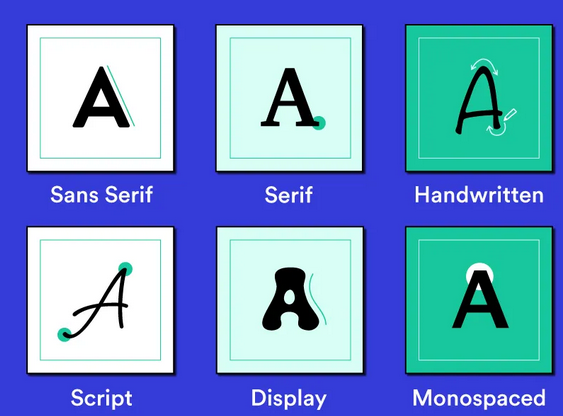
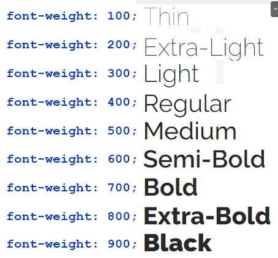
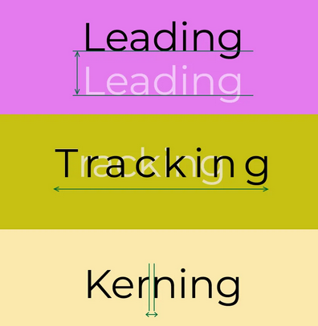
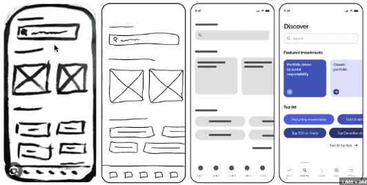

# UI UX DESIGN

## Typography

- Usually the starting point for designing
- Typefaces = group of fonts that are similar and designed by 1 group or company (google fonts, poppins, Rethink)
- A font within a typeface is usually selected for designing a site (Poppins bold 16px -- good for web and mobile)
- Typeface = family, font = individual family member

### Typefaces

#### Serif Fonts

- Serif fonts have small lines attached to the end of strokes in letters. These fonts are seen as formal, traditional, and trustworthy.
- Examples: Times New Roman, Georgia, Merriweather.
- Use Case: Print media, high-end brands, blogs, and news websites for body text. Gives a classic, professional feel.

#### Sans-Serif Fonts

- Sans-serif fonts are clean, modern, and lack the “feet” at the end of strokes.
- Examples: Helvetica, Arial, Roboto, Open Sans.
- Use Case: Digital screens, UI interfaces, tech websites, and modern brands. Best for readability on screens.

#### Script Fonts

- Mimic handwriting or calligraphy and are decorative in nature.
- Examples: Brush Script, Lobster, Pacifico.
- Use Case: Should be used sparingly for logos or headings. Avoid for body text as they are hard to read in long form.

#### Display Fonts

- Highly decorative fonts meant for limited use, often in large sizes.
- Examples: Impact, Bebas Neue, Playfair Display.
- Use Case: Headlines, posters, banners, and branding materials where you want to grab attention.

#### Monospace Fonts

- Every letter takes up the same amount of horizontal space.
- Examples: Courier, Consolas, Source Code Pro.
- Use Case: Code snippets, terminal interfaces, or designs where a techy or vintage aesthetic is needed.

### Font weight

- thickness of each character in the font

### Misc concepts

- Leading (Line height): The space between lines of text. Too tight makes it hard to read, too loose makes the text disjointed. For body text, a line-height of 1 to 1.2 times the font size is typically ideal and for Heading use 1.5 times.
- Tracking (letter spacing): The space between characters in a block of text, affecting the overall density of text. It’s better not to change this unless you know what you’re doing as it might create a bad reading experience.(0 to -3% recommended)
- Kerning: The space between specific pairs of letters to make the text look more balanced (e.g., A and V in some fonts).

#### Resources

<https://typescale.com> -
<https://www.fontshare.com/>
<https://fontjoy.com/>
<https://www.freefaces.gallery/>
<https://uncut.wtf/>

> NOTE: Check full notes here - <https://www.notion.so/UI-UX-Primitives-133b8021c11f809693bcebe5104cc8fe>

## Design Process

- Research the branch for which website is needed. (is it premium? is it Professional? etc)
- Select a typeface and colour palette based on the research
- Create low-fidelity to high-fidelity wireframes for the site. Create them for multiple screensizes(Desktop XL, desktop/laptop, Tablet, large phone, small phone, watch?, TV?)
- Create design in figma(start from desktop xl and go to smaller screensizes by removing components. This way you will have all components created in desktop xl design)
  
- Site should have following sections/ areas
  - Navbar - logo, login/ signup, about us, contact us, buy button, (hambuger menu for mobiles)
  - Hero section - Clear picture of what the site is for. minimal text, add images, slogan. Should highlight and capture users attention.
  - CTA(call to action) - where you expect user to do some actions - buy, sign up/ login, browse products, click on product for details etc.
  - Footer - about us, site map, contact us, address, email, terms, privacy, legal etc.
