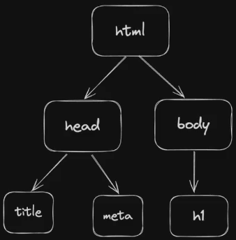

# MY NOTES

## GENERIC

- Taking arguement as env variable in a javascript

```bash
MYNUMBER=100 node index.js
#  Now read the env variable in the script as: console.log(process.env.MYNUMBER)
```

## MISC

- Use <https://httpdump.app/> to create fake endpoints to check your api/ routes.

## Javascript Basics

- Maps:

```javascript
//double each element
const input = [1, 2, 3, 4, 5];

function transform(i) {
  return i * 2;
}

const output = input.map(transform);
console.log(output);
```

- Filters:

```javascript
//filter and display only even values
const input = [1, 2, 3, 4, 5, 6, 7, 8];

function myFilter(i) {
  if (i % 2 == 0) {
    return true;
  } else {
    return false;
  }
}

const output = input.filter(myFilter);
console.log(output);

//alternate way using anonymous function
const output2 = input.filter((n) => {
  if (n % 2 == 0) {
    return true;
  } else {
    return false;
  }
});

console.log(ouptut2);
```

## Async Functions

- Examples - IO Operations(read/ writing to files), timeout/ wait/ timing operations, HTTP Requests
- Architecture for Async Functions
  - Call Stack
    - Data structure to keep track of function calls in the program.
    - It operates in 'Last In First Out' manner. When a function is called, it gets added to call stack and once it completes it is moved out of the stack.
  - Web APIs
    - Provided by Web browser or Node.js runtime.
    - Allows to do activities outside of java-script scope like making network calls, setting timers, or handling DOM events.
  - Callback Queue
    - It is a list of tasks (callbacks) that are waiting to be picked up by Call Stack.
    - These are added by Web APIs
  - Event Loop
    - Constantly checks if Call Stack is empty, if it is, it pushes first call from Callback Queue for execution in Call Stack

## Promises

- Example:
  - Promisified version - setTimeoutPromisified(3000).then(functionToCallback) ;
  - Callback version - setTimeout(fuctionToCallback, 3000);
- A promisified version of an async function does the same thing as the async function itself, it just has better syntax and readability.

```javascript
//Promises

//setTimeout(fuctionToCallback, 3000);

function setTimeoutPromisified(ms) {
  return new Promise((resolve) => setTimeout(resolve, ms));
}

function functionToCallback() {
  console.log("Wait completed");
}

setTimeoutPromisified(3000).then(functionToCallback);

//Following happens on execution
//1. setTimeoutPromisified function is called.
//2. This inturn creates and returns a Promise Object
//3. The Promise object does the following:
//    - It executes the async operation (wating, IO operation , network call etc.) with the provide wait time as arguement.
//    - once the waiting is completed, it calls a 'resolve' object/function. This 'resolve' will actually be the function that is passed in the 'then()'
```

## DOM Manipulation

- DOM = Document Object Model
- Represents the structure of the webpage as a 'tree of objects'
- This was used to create dynamic website before React is included.
- DOM allows manipulation of structure and content of the webpages dynamically.

;

## NODEJS

- It is an open-source JS runtime that allows to execute js code outside of a browser (or in a server).
- Build on Chrome's V8 engine
- Browser engines to run js:
  - chrome - V8
  - firefox - spidermonkey
  - safari - javascriptCore
- BUN
  - Alternate to Node.js (it is also a js runtime.)
  - Completely built from ground up.

### Intializing a project in Node.js

- create project folder
- navigate inside folder
- run - `npm init -y` (you should see some message for package.json)
  - Package.json:
    - name - name of the project
    - version - versioning
      - Format - MAJOR.MINOR.PATCH
        - MAJOR: major version changes or breaking changes from previous version.
        - MINOR: New feature addition or improvements in backward compatible manner.
        - PATCH: Backward compatible bug fixes or improvements.
      - The `^` sign in-front: it means npm will install any version compatible with this version (eg - "^5.3.1" means it can install any version from 5.3.1 to 5.9.9999 but not 6.0.0 because it will be a breaking change)
    - main - which file should be the entry point for the code.
    - scripts - developer specified scripts.
      - Example- Add `"start": "node index.js",` to scripts section. Now you can run `npm run start` in terminal to execute node index.js.
    - keywords - Metadata
    - author - Metadata
    - license - Metadata
    - description - Metadata
    - dependencies - Lists the packages required for the project to run. As the project user installs new packages, it gets added to this section
  - package.json-lock: even though, package.json provides a compatible version to install, sometimes minor version change between 2 developer machines/ local and server may arise due to package updates. This may cause code failures for our project. Hence, lock will automatically, lock to a single version of packages for whoever installs the project locally.
- open the folder in code editor
- create `index.js` in this folder
- Installing external package - `npm install <package name>`
  - This adds a folder `node_modules` in the project folder. node_modules contains the code and dependencies of the package itself.
- Setup project - `npm install`

### Some concepts in node.js/ javascript

```javascript
let x = '{"a": "test", "b":"other"}';
typeof x; //string

let y = JSON.parse(x); //convert string to json
typeof y; //object
console.log(y.a); //test
console.log(x.a); //undefined

let z = JSON.stringify(y); //convert json to string
typeof z; //string
console.log(z.b); //undefined
console.log(y.b); //other
```

## HTTP / HTTPS SERVERS

- whenever we use https, port is set to 443 by default
- whenever we use http, port is set to 80 by default
- whenever we use ssh, port is set to 22 by default

### Express

- Js library that lets us create http servers
- Routes: GET, POST, PUT, DELETE etc
- Boilerplate code for express server

```javascript
const express = require("express");
const app = express(); //initialize the app

app.use(express.json()); //allows access to request body

//APPLICATION LOGIC
//some code

//ROUTE HANDLERS
app.get("/", function (req, res){
  console.log("welcome");
  res.status(200).json("{
    "msg": "Welcome to the app!",
  })
});

//Dynamic route parameters in URL
app.get("/add/:a/:b", function(req, res){
  console.log("This is how to read dynamic routes");
  const a = req.params.a;
  const b = req.params.b;

  res.send(200).json("sum": (parseInt(a)+parseInt(b)));
})

app.post("/create-entry", function(req, res){
  console.log("In Post route");
  let data_id = req.query.id; //when url is - https://myapp/create-entry?id=123
  let data_content = req.body; //when body has some data

  res.code(200).send(`Successfully created entry with id: ${id} and data: ${data}`);
});

//LISTEN ON PORT
const PORT = 3000;
app.listen(PORT, () => {
  console.log(`Server started on port: ${PORT}`);
})

```

### Middlewares

- Middlewares are functions that are usually common functions in the server that can handle some common tasks.
- Middlewares need to have next() in their declaration.
- 2 ways to declare:
  - Like a normal function (with additional next() arguement)
  - Like `app.use()`
- Any route below the `app.use()` middleware will use the middleware by default.
- Error middlewares:
  - Special type of middleware.
  - Declared below all the routes.
  - Express will ensure this middleware is run whenever uncaught exception occurs
  - This middleware needs to have an additional arguement `err` in the declaration.

```javascript
const express = require("express");
const app = express();

app.use(express.json());

//APPLICATION LOGIC
let noOfRequests = 0;
let loggedIn = false;

//MIDDLEWARES
function getWelcomeMessage(req, res, next) {
  console.log("Welcome message from the middleware");
  next();
}

function getRequestCount(req, res, next) {
  noOfRequests = noOfRequests + 1;
  next();
}

function isLoggedIn(req, res, next) {
  if (loggedIn) {
    console.log("User is logged in. Continue...");
    next(); //this call is necessary for the control to go to next steps
  } else {
    res
      .status(401)
      .send("User is not logged in or is unauthorized. Terminate code here.");
  }
}

//ROUTES
//METHOD 1 - If middleware function is not passed, it will not be called.
app.get("/", getWelcomeMessage, function (req, res) {
  res.status(200).send("Hello!");
});

//METHOD 2 - All routes below the app.use() call will use the middleware passed here. The Routes do not need to call the middleware anymore
app.use(getRequestCount);

//below route calls getRequestCount automatically. getWelcomeMessage is not called.
app.get("/generic-data", function (req, res) {
  //get the request count after incrementing the counter in getRequestCount() middleware
  console.log(`This is request no: ${noOfRequests} to the server`);
  res.status(200).send("Showing generic content");
});

app.use(isLoggedIn);

//below route calls getRequestCount() and isLoggedIn() automatically.
app.get("/get-my-data", function (req, res) {
  //Below code is run only if both getRequestCount and isLoggedIn() run successfully.
  console.log("Showing only user specific data as the user is logged in");
  res.status(200).json({ msg: "user specific data for logged in user" });
});

//below route triggers error (Make `loggedIn=True`) after running getRequestCount and isLoggedIn()
app.get("/trigger-error", function (req, res) {
  console.log(
    "Triggering error. The error middleware will be called automatically",
  );
  throw new Error();
});

//ERROR MIDDLEWARE
function catchAllUncaughtExceptions(err, req, res, next) {
  console.log("Some uncaught exception occured");
}

//LISTEN TO PORT
const PORT = 3000;
app.listen(PORT, () => {
  console.log(`Server running on port: ${PORT}`);
});
```

### Some API

- Some webpages send background requests after the main call.
- Fetch

```html
<html>
  <head> </head>
  <body>
    <div id="posts"></div>
    <script>
      async function getRecentPost() {
        const response = await fetch(
          "https://jsonplaceholder.typicode.com/posts/1",
        );
        const data = await response.json();
        console.log(data);
        document.getElementById("posts").innerHTML = data.title;
      }
      getRecentPost();
    </script>
  </body>
</html>
```

- Fetch can also be used to make post calls

```javascript
async function sendPostRequest() {
  const response = await fetch("https://jsonplaceholder.typicode.com/posts/1", {
    method: POST,
    headers: {
      "Cookie": "tersitn",
      "content-Type":"application/json"
    }
    ...(more details)
  });
}
```

- AXIOS (external library)

```html
<!doctype html>
<html>
  <head>
    <script src="https://cdnjs.cloudflare.com/ajax/libs/axios/1.7.6/axios.min.js"></script>
  </head>

  <body>
    <div id="posts"></div>
    <script>
      async function fetchPosts() {
        const res = await axios.get(
          "https://jsonplaceholder.typicode.com/posts/1",
        );
        document.getElementById("posts").innerHTML = res.data.title;
      }
      fetchPosts();
    </script>
  </body>
</html>
```

### Connecting Front-End and Back-End

#### Different domains for FrontEnd and Backend

```javascript
//FOLDER STRUCTURE
/*
app
  public/
    index.html ----> frontend
  index.js ---> backend
  package.json
  package-lock.json
*/
```

- Serving Backend

  - Navigate to project folder and run --> `node index.js`
  - The server will start running on the port specified in index.js --> `http://localhost:PORT`

```

```

- Serving Frontend
  - Navigate to public folder and run --> `npx serve`
  - The front end (index.html) will run localhost at the port specified in the output of the command above.

#### Same domain for Frontend and Backend

```javascript
//FOLDER STRUCTURE
/*
app
  index.html ----> frontend
  index.js ---> backend
  package.json
  package-lock.json
*/


//index.js
const express = require("experess");

const app = express();

app.get("/", function(req, res)=>{
  res.sendFile(process.env.PWD+"/index.html"); //--> Sends the html on the same domain as the backend server
})

app.listen(3000);

//both front end and back end are on http://localhost:3000
```

### CORS

- CORS - Cross Origin Request Sharing
- This is a security feature that controls how resource on one webserver can be requested from another domain.
- Example:
  - User goes to <www.google.com/>
  - The page triggers a `background` request to another domain - <www.api.facebook.com/> ---> should not be allowed by <www.facebook.com>
  - But background request to <www.api.google.com/> should be allowed (as it is from google itself)
- Browser by default inserts `Referrer` into the background request when such background requests are send
- By default such cross origin requests(specially post or put requests) are denied by the called server.
- But most modern sites have different servers for frontend and backend code. In this case, we need to allow background requests between the two.
- If front-end and back-end are in same domain, then CORS issues will not happen(cors middleware is not required). Requests are accepted by default.

```html
<!doctype html>
<html>
  <head>
    <script src="https://cdnjs.cloudflare.com/ajax/libs/axios/1.7.6/axios.min.js"></script>
  </head>

  <body>
    <script>
      async function fetchPosts() {
        const res = await axios.post("https://api.anotherDomain.com/", {
          Authorization: "TestAPIKey",
        });
      }
    </script>
  </body>
</html>
```

```javascript
//index.js (backend code for accepting background reqests from certain domains only)
const express = require("express");
const cors = require("cors"); //---> Import the cors library. Need to do 'npm install cors'

const app = express();

app.use(express.json())
//app.use(cors()) //---> allows background requests from any domains.
app.use(cors({
  domains: ["http://google.com","http://facebook.com"] //---> domains that are allowed to make background request
}));

app.get("/", function(req, res_{
  console.log("Welcome!");
}));

app.listen(3000);
```

### JSONWEBTOKEN(jwt)

```javascript
/* JSON WEB TOKEN - JWT
 * Steps:
 * 1. Install(npm install jsonwebtoken) and import 'jsonwebtoken' library
 * 2. Create a variable to store a random key. `JWT_SECRET` variable
 * 3. Create a jwt token for a user by passing some parameter of the user (username in this case)
 * 4. Use `jwt.verify` to verify the token.
 */
const express = require("express");
const jwt = require("jsonwebtoken"); //STEP 1
const JWT_SECRET = "RandomStringForCreatingJWT1233289"; //STEP 2 (this should be moved to env)
const app = express();

app.use(express.json());

//application logic

let users = [];

//Routes
app.get("/", function (req, res) {
  console.log("Welcome!");

  res.status(200).send("Welcome to my app!");
});

app.post("/signup", function (req, res) {
  const username = req.body.username;
  const password = req.body.password;

  //check if user is already signed to
  if (users.find((user) => user.username === username)) {
    console.log(`Account with username ${username} already exists.`);
    res.status(400).send(`Account with username ${username} already exists.`);
  }

  //create entry into db
  user = {
    username: username,
    password: password,
  };
  users.push(user);
  console.log(`User registered successfully!`);
  res.status(200).send(`User registration successful!`);
});

app.post("/signin", function (req, res) {
  const username = req.body.username;
  const password = req.body.password;

  //Return token if signin successful;
  //TOKEN need not be saved in the db/users[] anymore as the token is `stateless`.
  //The token contains the information required for verification. See app.get("/me")
  if (
    users.find(
      (user) => user.username === username && user.password === password,
    )
  ) {
    console.log("Signin successful");
    res.status(200).json({
      msg: "Signin is successful",
      token: jwt.sign({ username: username }, JWT_SECRET), //STEP 3
    });
  } else {
    console.log(`Signin unsuccessful for user: ${username}`);
    res.status(401).send(`Username or password does not match our records`);
  }
});

app.get("/me", function (req, res) {
  const token = req.headers.authorization; //jwt token will be provided in request
  const decodedInfoFromToken = jwt.verify(token, JWT_SECRET); //STEP 4 (returns {username: username})
  const usernameFromToken = decodedInfoFromToken.username;

  //get the user from db
  const foundUser = users.find((user) => user.username === usernameFromToken);

  if (foundUser) {
    console.log("Displaying user information");
    res.status(200).json({
      username: foundUser.username,
      password: foundUser.password,
    });
  } else {
    console.log(
      `User with username: ${username} not found! This should not have happened with jwt implemented`,
    );

    res.status(500).send("Something went wrong");
  }
});

//LISTEN
const PORT = 3000;
app.listen(PORT, () => {
  console.log(`Server running on port ${PORT}`);
});
```

#### jwt vs cookies

- jwts need to be stored in the browser explicitly. Cookies are stored automatically.
- Cookies are set by the application by using the header `Set-Cookie` and the browser automatically sends the cookie in the `cookie` header in all subsequent requests.
- Cookies only work in webapp/ browser. Wont work in Mobile.
