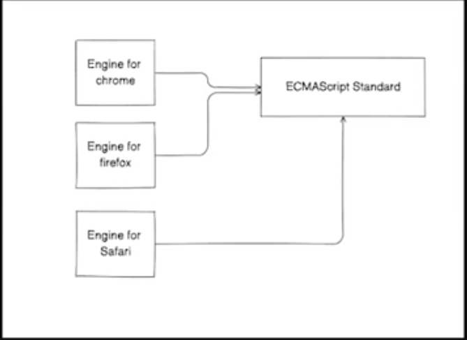

# JAVASCRIPT

## Architecture

## Node.js
- it is a wrapper aroud the javascript engines
- It is a Javascript runtime that runs the javascript engines / browser engines without the browser ui

## Primitives
- Variables:
  - numbers
  - strings
  - arrays
- Objects
- loops:
  - while
  - for
- Functions (primitives, callbacks)
- API (Native, Web)

> Code: https://replit.com/@adi_repl/JSNotes1

## Characteristics of Javascript
- Single Threaded
- Asynchronous
- Loosly typed
- Interpreted
- NativeJS Vs APIs

